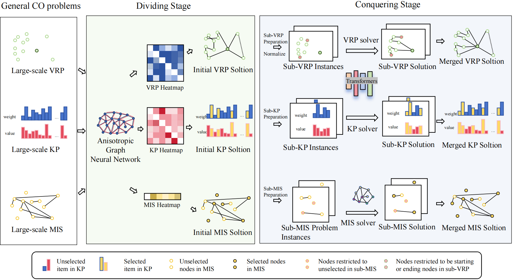

# Readme

Code for paper accepted by NeurIPS 2024:

[**UDC: A Unified Neural Divide-and-ConquernFramework for Large-Scale Combinatorial Optimization Problems**](https://arxiv.org/pdf/2407.00312)

The paper in the repository is the latest version (NOT the camera ready version yet), with significant modifications compared to the initial version of arxiv.

Some of the code comes from https://github.com/yd-kwon/POMO, https://github.com/yd-kwon/MatNet, and https://github.com/henry-yeh/GLOP. Thank them for their implementations.

### Settings & Dependencies

The code for each CO problem defaults to retaining the parameters in training the pre-trained model and the parameters used for testing. Please refer to our Paper for training settings and testing settings.

Most of the parameters have been indicated in the test/train.py files for each CO problem. For the number of conquering stages r, please modify this setting under the validation function in Tester.py for each problem.

Notable dependencies on our environment:

* python = 3.9

* torch-geometric = 2.4.0

* torch = 1.12.1

* networkx = 2.6.3

* numpy = 1.22.4

### Data & Model

UDC is trained using reinforcement learning, and the random data generation method is demonstrated in ten files such as UDC/ATSProblemDef.py and UDC/OPProblemDef.py.

Please download test sets and pre-trained models from Google Drive https://drive.google.com/file/d/1lVWBPvxhHDd-ZLJNCorGJugi_Smrx8uh/view?usp=sharing.

### Reproduction

Download pre-trained models and test sets to reproduce the results reported in the article.

Randomness: there will be randomness if running two test sets in one single run or using different batch sizes.

For randomly generated instances, reported results are from the max batch size on a single NVIDIA RTX 3090 GPU (e.g., 6 for CVRP500 with $\alpha=50$). We also test only one test set during a single run.

### Further Improvement

We have verified the legality of the corresponding solutions for each problem. We will continue to strive to improve its clarity and welcome any minor errors in the code implementation.

If there are any issues in running or re-implementing the code, please contact the author Zhi Zheng via email in a timely manner.